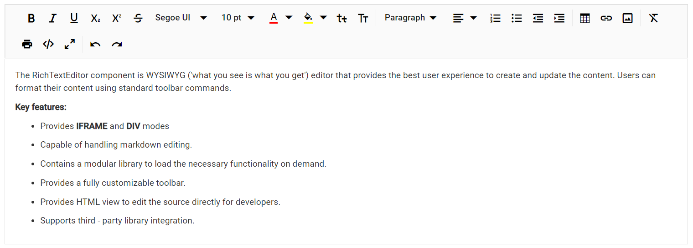
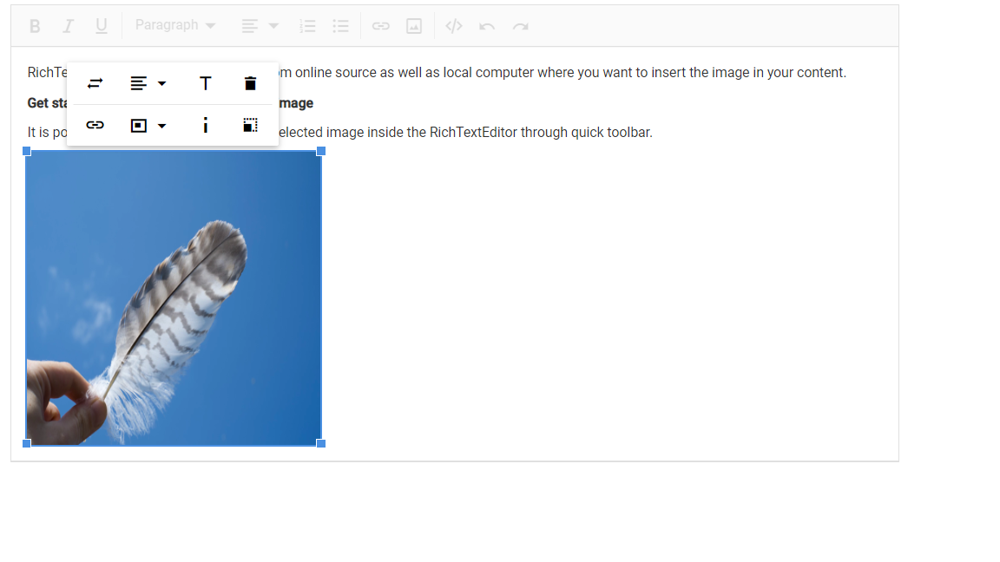
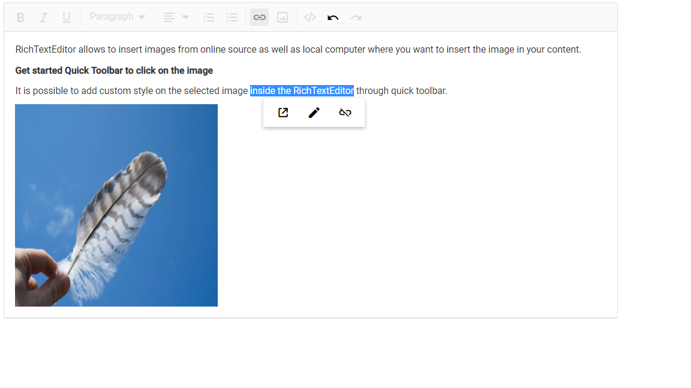

# Toolbar

The Rich Text Editor toolbar contains a collection of tools such as bold, Italic, and text alignment buttons that are used to format the content. However, in most integrations, you can customize the toolbar configurations easily to suit your needs.

The Rich Text Editor allows you to configure different types of toolbar using `RichTextEditorToolbarSettings` `Type` property. The types of toolbar are:

1. Expand
2. MultiRow

## Expand Toolbar

The default mode of `RichTextEditorToolbarSettings` `Type` as Expand to hide the overflowing items in the next row. By clicking the expand arrow, view the overflowing toolbar items.

```csharp

@using Syncfusion.Blazor
@using Syncfusion.Blazor.RichTextEditor

<SfRichTextEditor>
    <RichTextEditorToolbarSettings Items="@Tools" Type="ToolbarType.Expand"></RichTextEditorToolbarSettings>
    <p>The Rich Text Editor component is WYSIWYG ('what you see is what you get') editor that provides the best user experience to create and update the content. Users can format their content using standard toolbar commands.</p>
    <p><b> Key features:</b></p>
    <ul>
    <li><p>Provides <b>IFRAME</b> and <b>DIV</b> modes </p></li>
    <li><p> Capable of handling markdown editing.</p></li>
    <li><p> Contains a modular library to load the necessary functionality on demand.</p></li>
    <li><p> Provides a fully customizable toolbar.</p></li>
    <li><p> Provides HTML view to edit the source directly for developers.</p></li>
    <li><p> Supports third - party library integration.</p></li>
    </ul>
</SfRichTextEditor>

@code {
    public object[] Tools = new object[]{
        "Bold", "Italic", "Underline", "SubScript", "SuperScript", "StrikeThrough",
        "FontName", "FontSize", "FontColor", "BackgroundColor",
        "LowerCase", "UpperCase", "|",
        "Formats", "Alignments", "OrderedList", "UnorderedList",
        "Outdent", "Indent", "|", "CreateTable",
        "CreateLink", "Image", "|", "ClearFormat", "Print",
        "SourceCode", "FullScreen", "|", "Undo", "Redo"
    };
}

```

The output will be as follows.


## Multi-row Toolbar

Set the `RichTextEditorToolbarSettings` `Type` as MultiRow to display the toolbar items in a row-wise format. All toolbar items are visible always.

```csharp

@using Syncfusion.Blazor
@using Syncfusion.Blazor.RichTextEditor

<SfRichTextEditor>
    <RichTextEditorToolbarSettings Items="@Tools" Type="ToolbarType.MultiRow"></RichTextEditorToolbarSettings>
    <p>The Rich Text Editor component is WYSIWYG ('what you see is what you get') editor that provides the best user experience to create and update the content. Users can format their content using standard toolbar commands.</p>
    <p><b> Key features:</b></p>
    <ul>
    <li><p> Provides <b>IFRAME</b> and <b>DIV</b> modes </p></li>
    <li><p> Capable of handling markdown editing.</p></li>
    <li><p> Contains a modular library to load the necessary functionality on demand.</p></li>
    <li><p> Provides a fully customizable toolbar.</p></li>
    <li><p> Provides HTML view to edit the source directly for developers.</p></li>
    <li><p> Supports third - party library integration.</p></li>
    </ul>
</SfRichTextEditor>

@code {
    public object[] Tools = new object[]{
        "Bold", "Italic", "Underline", "SubScript", "SuperScript", "StrikeThrough",
        "FontName", "FontSize", "FontColor", "BackgroundColor",
        "LowerCase", "UpperCase", "|",
        "Formats", "Alignments", "OrderedList", "UnorderedList",
        "Outdent", "Indent", "|", "CreateTable",
        "CreateLink", "Image", "|", "ClearFormat", "Print",
        "SourceCode", "FullScreen", "|", "Undo", "Redo"
    };
}

```

The output will be as follows.



## Floating Toolbar

By default, toolbar is float at the top of the Rich Text Editor on scrolling. It can be customized by specifying the offset of the floating toolbar from documents top position using `FloatingToolbarOffset`.

Enable or disable the floating toolbar using `EnableFloating` of the `RichTextEditorToolbarSettings` property.

```csharp

@using Syncfusion.Blazor
@using Syncfusion.Blazor.RichTextEditor

<SfRichTextEditor>
    <RichTextEditorToolbarSettings EnableFloating="false"></RichTextEditorToolbarSettings>
    <p>The Rich Text Editor component is WYSIWYG ('what you see is what you get') editor that provides the best user experience to create and update the content. Users can format their content using standard toolbar commands.</p>
    <p><b> Key features:</b></p>
    <ul>
    <li><p> Provides <b>IFRAME</b> and <b>DIV</b> modes </p></li>
    <li><p> Capable of handling markdown editing.</p></li>
    <li><p> Contains a modular library to load the necessary functionality on demand.</p></li>
    <li><p> Provides a fully customizable toolbar.</p></li>
    <li><p> Provides HTML view to edit the source directly for developers.</p></li>
    <li><p> Supports third - party library integration.</p></li>
    </ul>
</SfRichTextEditor>

```

## Toolbar items

The following table lists the tools available in the toolbar.

| Name | Summary | Initialization |
|----------------|---------|------------------------------------------|
| Undo | Allows to undo the actions.|public object[] Tools = new object[]{`"Undo"`} |
| Redo | Allows to redo the actions.|public object[] Tools = new object[]{`"Redo"`} |
| Alignment | Aligns the content with left, center, and right margin.|public object[] Tools = new object[]{`"Alignments"`} |
| OrderedList | Creates a new list item(numbered). |public object[] Tools = new object[]{`"OrderedList"`} |
| UnorderedList | Creates a new list item(bulleted). |public object[] Tools = new object[]{`"UnorderedList"`} |
| Indent | Allows to increase the indent level of the content.|public object[] Tools = new object[]{`"Indent"`}|
| Outdent | Allows to decrease the indent level of the content.|public object[] Tools = new object[]{`"Outdent"`}|
| Hyperlink | Creates a hyperlink to a text or image to a specific location in the content.|public object[] Tools = new object[]{`"CreateLink"`}|
| Images | Inserts an image from an online source or local computer. |public object[] Tools = new object[]{`"Image"`} |
| LowerCase | Changes the case of selected text to lower in the content. |public object[] Tools = new object[]{`"LowerCase"`} |
| UpperCase | Changes the case of selected text to upper  in the content.|public object[] Tools = new object[]{`"UpperCase’"`} |
| SubScript | Makes the selected text as subscript (lower).|public object[] Tools = new object[]{`"SubScript"`} |
| SuperScript | Makes the selected text as superscript (higher).|public object[] Tools = new object[]{`"SuperScript’"`} |
| Print | Allows to print the editor content. |public object[] Tools = new object[]{`"Print"`} |
| FontName | Defines the fonts that appear under the Font Family DropDownList from the Rich Text Editor's toolbar. |public object[] Tools = new object[]{`"FontName"`}|
| FontSize | Defines the font sizes that appear under the Font Size DropDownList from the Rich Text Editor's toolbar.|public object[] Tools = new object[]{`"FontSize"`}|
| FontColor | Specifies an array of colors can be used in the colors popup for font color.|public object[] Tools = new object[]{`"FontColor"`} |
| BackgroundColor | Specifies an array of colors can be used in the colors popup for background color.|public object[] Tools = new object[]{`"BackgroundColor"`} |
| Format | An Object with the options that will appear in the Paragraph Format dropdown from the toolbar. |public object[] Tools = new object[]{`"Formats"`} |
| StrikeThrough | Applies double line strike through formatting for the selected text. |public object[] Tools = new object[]{`"StrikeThrough"`} |
| ClearFormat | The clear format tool is useful to remove all formatting styles (such as bold, italic, underline, color, superscript, subscript, and more) from currently selected text. As a result, all the text formatting will be cleared and return to its default formatting styles.|public object[] Tools = new object[]{`"ClearFormat"`} |
| FullScreen | Stretches the editor to the maximum width and height of the browser window.|public object[] Tools = new object[]{`"FullScreen"`} |
| SourceCode | Rich Text Editor includes the ability for users to directly edit HTML code via "Source View". If you made any modification in Source view directly, synchronize with Design view.|public object[] Tools = new object[]{`"SourceCode"`} |

By default, tools will be arranged in the following order.

> items: ['Bold', 'Italic', 'Underline', '|', 'Formats', 'Alignments', 'OrderedList', 'UnorderedList', '|', 'CreateLink', 'Image', '|', 'SourceCode', 'Undo', 'Redo']

The tools order can be customized as your application requirement. If you are not specifying any tools order, the editor will create the toolbar with default items.

## Custom Tool

The Rich Text Editor allows you to configure your own commands to its toolbar using `RichTextEditorToolbarSettings` property. The command can be plain text, icon, HTML template or HTML selector. You can also define the order and group where the command should be included. Bind the action to the command by getting its instance.

This sample shows how to add your own commands to toolbar of the Rich Text Editor. The `Ω` command is added to insert special characters in the editor.

Refer to the following code snippet for custom tool with tooltip text which will be included in items field of `RichTextEditorToolbarSettings` property.

```csharp

@using Syncfusion.Blazor
@using Syncfusion.Blazor.Buttons
@using Syncfusion.Blazor.RichTextEditor

<SfRichTextEditor>
    <RichTextEditorToolbarSettings Items="@Tools"></RichTextEditorToolbarSettings>
    <p>The Rich Text Editor component is WYSIWYG ('what you see is what you get') editor that provides the best user experience to create and update the content. Users can format their content using standard toolbar commands.</p>
    <p><b> Key features:</b></p>
    <ul>
        <li><p>Provides <b>IFRAME</b> and <b>DIV</b> modes </p></li>
        <li><p> Capable of handling markdown editing.</p></li>
        <li><p> Contains a modular library to load the necessary functionality on demand.</p></li>
        <li><p> Provides a fully customizable toolbar.</p></li>
        <li><p> Provides HTML view to edit the source directly for developers.</p></li>
        <li><p> Supports third - party library integration.</p></li>
    </ul>
</SfRichTextEditor>

<SfButton id="custom" @onclick="ClickHandler">Ω</SfButton>

@code {

    public object[] Tools = new object[] {
        "Bold", "Italic", "Underline", "|", new ToolsCollection { tooltipText = "Insert Symbol", template = "#custom" }, "SourceCode", "FullScreen"
    };

    public class ToolsCollection
    {
        public string tooltipText { get; set; }
        public string template { get; set; }
    }

    public void ClickHandler()
    {
        //Perform your action here
    }

}
```

## Quick inline toolbar

Quick commands are opened as context-menu on clicking the corresponding element. The commands must be passed as string collection to image, text, and link attributes of the `RichTextEditorQuickToolbarSettings` property.

| Target Element | Default Quick Toolbar items |
|----------------|---------|
| Image | 'Replace', 'Align', 'Caption', 'Remove', 'InsertLink', 'Display', 'AltText','Dimension'.|
| Link | 'Open', 'Edit', 'UnLink'.|
| Text | 'Cut', 'Copy', 'Paste'.|

Custom tool can be added to the corresponding quick toolbar, using the `RichTextEditorQuickToolbarSettings` property.

The following sample demonstrates the option to insert the image to the Rich Text Editor content as well as option to rotate the image through the quick toolbar. The image rotation functionalities have been achieved through the `OnToolbarClick` event.

```csharp

@using Syncfusion.Blazor
@using Syncfusion.Blazor.RichTextEditor

<SfRichTextEditor>
    <RichTextEditorQuickToolbarSettings Image="@Items" Link="@Link"></RichTextEditorQuickToolbarSettings>
    <p>Rich Text Editor allows to insert images from online source as well as local computer where you want to insert the image in your content.</p>
    <p><b>Get started Quick Toolbar to click on the image</b></p>
    <p>It is possible to add custom style on the selected image inside the Rich Text Editor through quick toolbar.</p>
    
</SfRichTextEditor>

@code {
    public object[] Items = new object[] {
        "Replace", "Align", "Caption", "Remove",
        "InsertLink", "OpenImageLink", "-", "EditImageLink",
        "RemoveImageLink", "Display", "AltText", "Dimension"
    };

    public object[] Link = new object[] {
        "Open", "Edit", "UnLink"
    };
}

```

The output will be as follows.





## See Also

* [How to render the toolbar in inline mode](./inline-mode/)