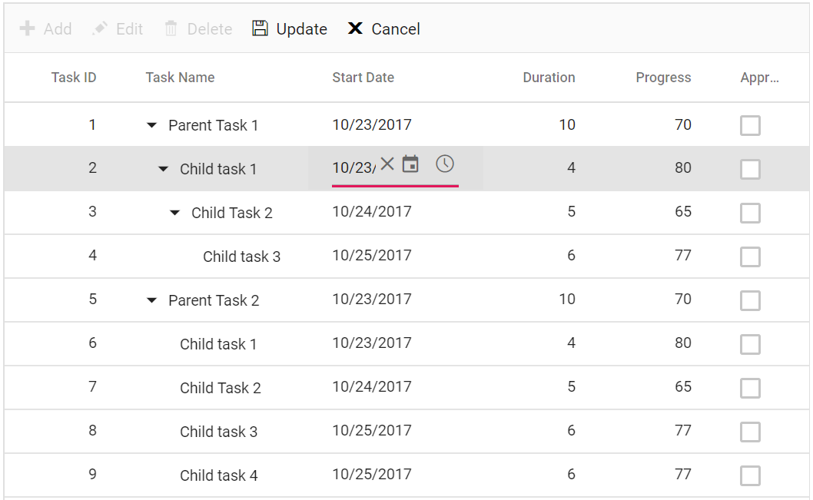
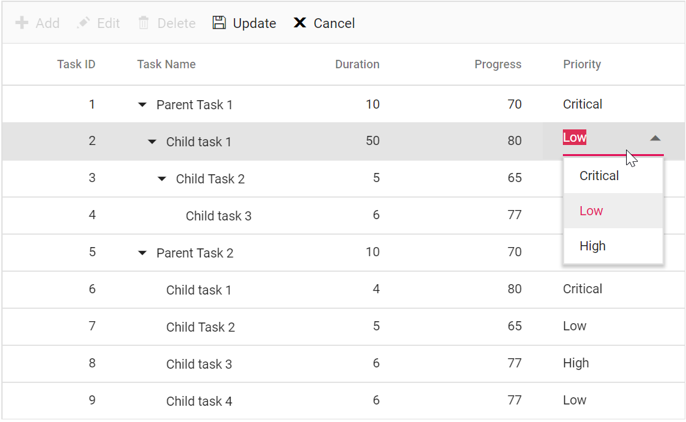
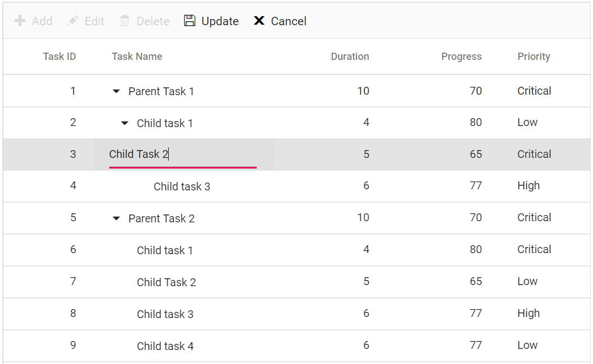
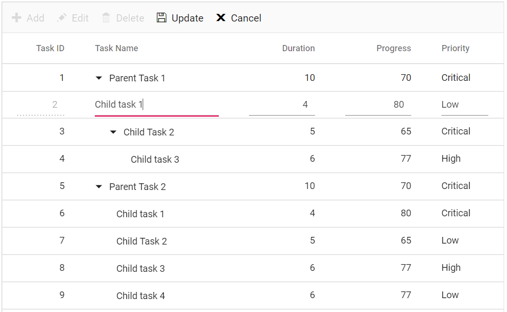
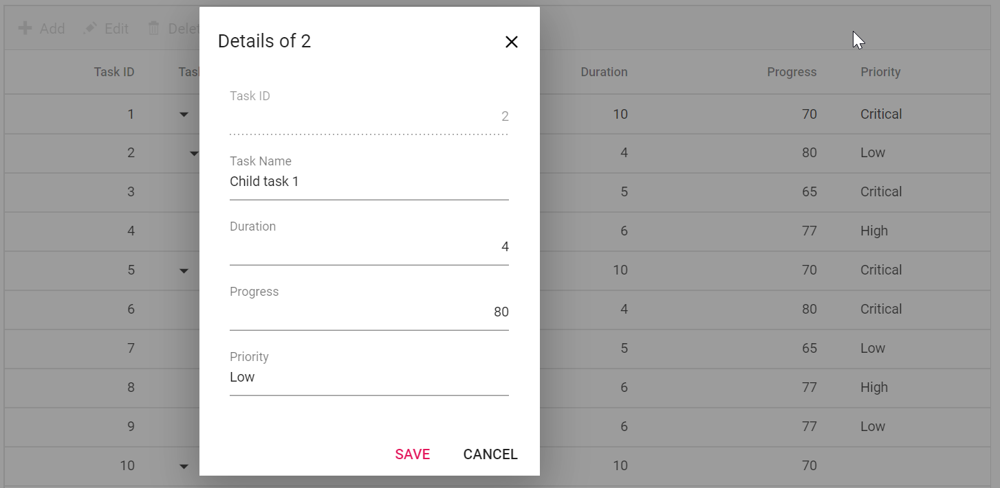
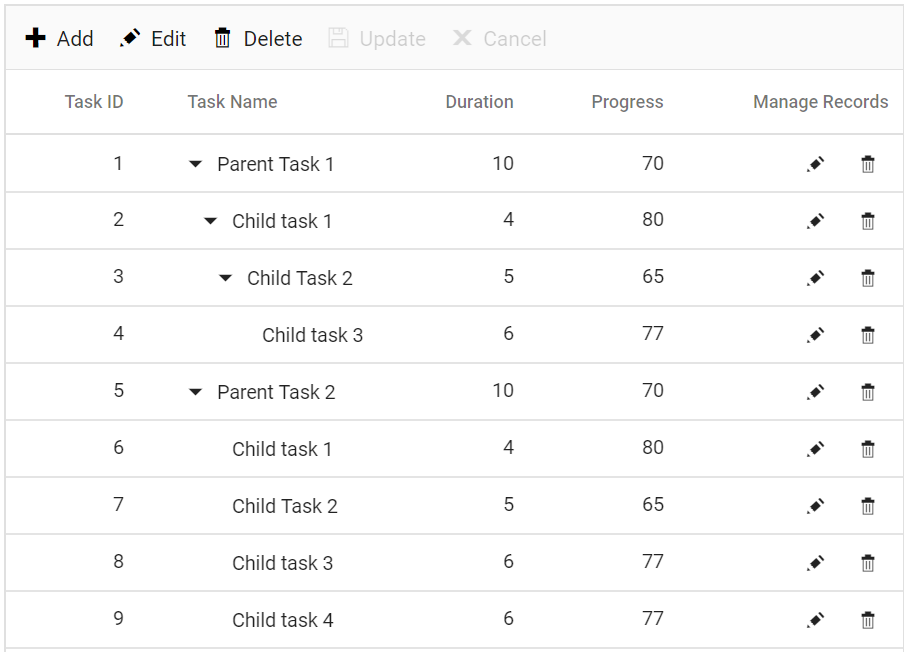
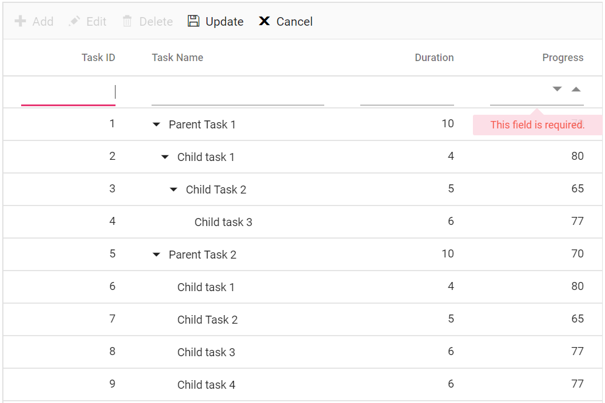

# Editing

The Tree Grid component has options to dynamically insert, delete and update records.
Editing feature is enabled by using [`TreeGridEditSettings`](https://help.syncfusion.com/cr/blazor/Syncfusion.Blazor~Syncfusion.Blazor.TreeGrid.TreeGridEditSettings.html) property and it requires a primary key column for CRUD operations.
To define the primary key, set [`TreeGridColumn.IsPrimaryKey`](https://help.syncfusion.com/cr/blazor/Syncfusion.Blazor~Syncfusion.Blazor.TreeGrid.TreeGridColumn~IsPrimaryKey.html) to **true** in particular column.





You can disable editing for a particular column, by specifying
[`TreeGridColumn.AllowEditing`](https://help.syncfusion.com/cr/cref_files/aspnetcore-js2/Syncfusion.EJ2~Syncfusion.EJ2.TreeGrid.TreeGridColumn~AllowEditing.html) to **false**.

> To perform the editing operation in the Blazor Tree Grid, we recommend to mention the respective model class type (List<TreeData.BusinessObject>), in the Tree Grid's dataSource property value.

```csharp

@code{
    public List<TreeData.BusinessObject> TreeGridData { get; set; }
    protected override void OnInitialized()
    {
        this.TreeGridData = TreeData.GetSelfDataSource().ToList();
    }
}

```

## Toolbar with edit option

The tree grid toolbar has the built-in items to execute Editing actions.
You can define this by using the [`Toolbar`](https://help.syncfusion.com/cr/cref_files/aspnetcore-js2/Syncfusion.EJ2~Syncfusion.EJ2.TreeGrid.TreeGrid~Toolbar.html) property.





The following output is displayed as a result of the above code example.


## Cell edit type and its params

The [`TreeGridColumn.EditType`](https://help.syncfusion.com/cr/blazor/Syncfusion.Blazor~Syncfusion.Blazor.TreeGrid.TreeGridColumn~EditType.html) is used to customize the edit type of the particular column.
You can set the [`TreeGridColumn.EditType`](https://help.syncfusion.com/cr/blazor/Syncfusion.Blazor~Syncfusion.Blazor.TreeGrid.TreeGridColumn~EditType.html) based on data type of the column.

* [`NumericTextBox`](../numerictextbox/getting-started) component for integers, double, and decimal data types.

* [`TextBox`](../textbox/getting-started) component for string data type.

* [`DropDownList`](../dropdownlist/getting-started) component for list data type.

* [`DatePicker`](../datepicker/getting-started) component for date values.

* [`DateTimePicker`](../datetimepicker/getting-started) component for datetime type.

* [`Checkbox`](../check-box/getting-started) component for boolean type.

Also, you can customize model of the [`TreeGridColumn.EditType`](https://help.syncfusion.com/cr/blazor/Syncfusion.Blazor~Syncfusion.Blazor.TreeGrid.TreeGridColumn~EditType.html) component through the [`TreeGridColumn.Edit.params`](https://help.syncfusion.com/cr/blazor/Syncfusion.Blazor~Syncfusion.Blazor.TreeGrid.TreeGridColumn~Edit.html).

The following table describes cell edit type component and their corresponding edit params of the column.

Component |Example
-----|-----
[`NumericTextBox`](../numerictextbox/getting-started) | @(new { @params = new { format = "n"} })
[`TextBox`](../textbox/getting-started) | -
[`DropDownList`](../dropdownlist/getting-started) | @(new { @params = new { value = "Germany"} })
[`DatePicker`](../datepicker/getting-started) | @(new { @params = new { format = "yyyy-MM-dd"} })
[`DateTimePicker`](../datetimepicker/getting-started) | @(new { @params = new { strictMode = true} })
[`Checkbox`](../check-box/getting-started) | @(new { @params = new { checked = true} })





The following output is displayed as a result of the above code example.



> If edit type is not defined in the column, then it will be considered as the **stringedit** type (Textbox component).

## Cell Edit Template

The cell edit template is used to add a custom component for a particular column when the column is edited.

The following code example describes, how to define the Edit template for a particular column.





The following output is displayed as a result of the above code example.



## Edit Modes

Tree Grid supports the following types of edit modes, they are:

* Cell
* Row
* Dialog

### Cell

In Cell edit mode, when you double click on a cell, it is changed to edit state.
You can change the cell value and save to the data source.
To enable Cell edit, set the [`TreeGridEditSettings.Mode`](https://help.syncfusion.com/cr/blazor/Syncfusion.Blazor~Syncfusion.Blazor.TreeGrid.TreeGridEditSettings~Mode.html) as **Cell**.





The following output is displayed as a result of the above code example.



> Cell edit mode is default mode of editing.

### Row

In Row edit mode, when you start editing the currently selected record, the entire row is changed to edit state.
You can change the cell values of the row and save edited data to the data source.
To enable Row edit, set the [`TreeGridEditSettings.Mode`](https://help.syncfusion.com/cr/blazor/Syncfusion.Blazor~Syncfusion.Blazor.TreeGrid.TreeGridEditSettings~Mode.html) as **Row**.





The following output is displayed as a result of the above code example.



### Dialog

In Dialog edit mode, when you start editing the currently selected row, data will be shown on a dialog.
You can change the cell values and save edited data to the data source.
To enable Dialog edit, set the [`TreeGridEditSettings.Mode`](https://help.syncfusion.com/cr/blazor/Syncfusion.Blazor~Syncfusion.Blazor.TreeGrid.TreeGridEditSettings~Mode.html) as **Dialog**.





The following output is displayed as a result of the above code example.



### Batch

In Batch edit mode, when you double-click on the tree grid cell, the target cell goes into edit state.
You can bulk save (added, changed and deleted data in the single request) to data source by clicking on the toolbar's **Update** button or by externally invoking the `BatchSave` method.
To enable Batch edit, set the [`Mode`](https://help.syncfusion.com/cr/blazor/Syncfusion.Blazor~Syncfusion.Blazor.TreeGrid.TreeGridEditSettings~Mode.html) property of `TreeGridEditSettings` as **Batch**.





## Dialog template

The dialog template editing provides an option to customize the default behavior of dialog editing. Using the dialog template, you can render your own editors by defining the [`TreeGridEditSettings.Mode`](https://help.syncfusion.com/cr/blazor/Syncfusion.Blazor~Syncfusion.Blazor.TreeGrid.TreeGridEditSettings~Mode.html) as **Dialog** and [`Template`](https://help.syncfusion.com/cr/blazor/Syncfusion.Blazor~Syncfusion.Blazor.TreeGrid.TreeGridEditSettings~Template.html) using the **Template** of the **TreeGridEditSettings**.

In some cases, you need to add the new field editors in the dialog which are not present in the column model. In that situation, the dialog template will help you to customize the default edit dialog.

In the following sample, tree grid enabled with dialog template editing.





The following output is displayed as a result of the above code example.


> The template form editors should have **name** attribute.

 <!-- Get value from editor

You can read, format, and update the current editor value in the [`ActionBegin`](https://help.syncfusion.com/cr/cref_files/aspnetcore-js2/Syncfusion.EJ2~Syncfusion.EJ2.TreeGrid.TreeGrid~ActionBegin.html) event at the time of setting `requestType` to `save`.

In the following code example, the `progress` value has been formatted and updated.

``` typescript
    function actionBegin(args) {
        if (args.requestType === 'save') {
            // cast string to integer value.
            args.data['progress'] = parseFloat(args.form.querySelector("#progress").value);
        }
    }

```

 Set focus to editor

By default, the first input element in the dialog will be focused while opening the dialog.
If the first input element is in disabled or hidden state, focus the valid input element in the
[`ActionComplete`](https://help.syncfusion.com/cr/cref_files/aspnetcore-js2/Syncfusion.EJ2~Syncfusion.EJ2.TreeGrid.TreeGrid~ActionComplete.html)
event based on `requestType` as `beginEdit`.

```typescript

    function actionComplete(args) {
        // Set initail Focus
        if (args.requestType === 'beginEdit') {
            (args.form.elements.namedItem('taskName')as HTMLInputElement).focus();
        }
    }

```

 Adding validation rules for custom editors

If you have used additional fields that are not present in the column model, then add the validation rules to the [`ActionComplete`](https://help.syncfusion.com/cr/cref_files/aspnetcore-js2/Syncfusion.EJ2~Syncfusion.EJ2.TreeGrid.TreeGrid~ActionComplete.html) event.

```typescript

    function actionComplete(args: DialogEditEventArgs) {
        if ((args.requestType === 'beginEdit' || args.requestType === 'add')) {
            // Add Validation Rules
            args.form.ej2_instances[0].addRules('progress', {max: 100});
        }
    }

```
-->

## Adding row position

The Tree Grid control provides the support to add the new row in the top, bottom, above selected row, below selected row and child position of tree grid content using [`TreeGridEditSettings.NewRowPosition`](https://help.syncfusion.com/cr/blazor/Syncfusion.Blazor~Syncfusion.Blazor.TreeGrid.TreeGridEditSettings~NewRowPosition.html) property. By default, a new row will be added at the top of the tree grid.





The following examples shows how to set new row position as **Child** in tree grid.

## Command column

The command column provides an option to add CRUD action buttons in a column. This can be defined by the [`TreeGridColumn.Commands`](https://help.syncfusion.com/cr/blazor/Syncfusion.Blazor~Syncfusion.Blazor.TreeGrid.TreeGridColumn~Commands.html) property.

The available built-in command buttons are:

| Command Button | Actions |
|----------------|---------|
| Edit | Edit the current row.|
| Delete | Delete the current row.|
| Save | Update the edited row.|
| Cancel | Cancel the edited state. |





The following output is displayed as a result of the above code example.



<!--Custom command

 The custom command buttons can be added in a column by using the [`TreeGridColumn.Commands`](https://help.syncfusion.com/cr/blazor/Syncfusion.Blazor~Syncfusion.Blazor.TreeGrid.TreeGridColumn~Commands.html) property and
the action for the custom buttons can be defined in the `ButtonOption.Click` event.

```csharp

@using TreeGridComponent.Data;
@using Syncfusion.Blazor.TreeGrid;

<SfTreeGrid DataSource="@TreeGridData" IdMapping="TaskId" ParentIdMapping="ParentId" TreeColumnIndex="1" Toolbar="@(new List<string>() { "Add", "Edit", "Delete", "Update", "Cancel" })">
    <TreeGridEditSettings AllowEditing="true" AllowAdding="true" AllowDeleting="true" Mode="Syncfusion.Blazor.TreeGrid.EditMode.Row" />
    <TreeGridColumns>
        <TreeGridColumn Field="TaskId" HeaderText="Task ID" IsPrimaryKey="true" Width="80" TextAlign="Syncfusion.Blazor.Grids.TextAlign.Right"></TreeGridColumn>
        <TreeGridColumn Field="TaskName" HeaderText="Task Name" Width="160"></TreeGridColumn>
        <TreeGridColumn Field="Duration" HeaderText="Duration" Width="100" TextAlign="Syncfusion.Blazor.Grids.TextAlign.Right"></TreeGridColumn>
        <TreeGridColumn Field="Progress" HeaderText="Progress" Width="100" TextAlign="Syncfusion.Blazor.Grids.TextAlign.Right"></TreeGridColumn>
        <TreeGridColumn HeaderText="Manage Records" Width="150" Commands="@commands"></TreeGridColumn>
    </TreeGridColumns>
</SfTreeGrid>

@code{
    public List<TreeData.BusinessObject> TreeGridData { get; set; }
    public  List<object> commands { get; set; }
    protected override void OnInitialized()
    {
        this.commands = new List<object>();
        commands.Add(new { type = "taskstatus", buttonOption = new { content = "Details", cssClass = "e-flat e-details", click = @onClick } }); // custom

        this.TreeGridData = TreeData.GetSelfDataSource().ToList();
    }
    private void onClick()
    {

    }
}

```
-->

## Confirmation messages

### Delete confirmation

The delete confirm dialog can be shown when deleting a record by defining the [`ShowDeleteConfirmDialog`](https://help.syncfusion.com/cr/blazor/Syncfusion.Blazor~Syncfusion.Blazor.TreeGrid.TreeGridEditSettings~ShowDeleteConfirmDialog.html) as **true**





The following output is displayed as a result of the above code example.


> The **ShowDeleteConfirmDialog** supports all type of edit modes.

## Column validation

Column validation allows you to validate the edited or added row data and it display errors for invalid fields before saving data.
Tree Grid uses **Form Validator** component for column validation.
You can set validation rules by defining the [`TreeGridColumn.ValidationRules`](https://help.syncfusion.com/cr/blazor/Syncfusion.Blazor~Syncfusion.Blazor.TreeGrid.TreeGridColumn~ValidationRules.html).





The following output is displayed as a result of the above code example.



<!-- Custom validation

You can define your own custom validation rules for the specific columns by using **Form Validator custom rules**.

In the below demo, custom validation applied for **Priority** column.
-->

## Entity Framework

This section uses and follows the code explained in the [`Entity Framework data binding`](./data-binding/#entity-framework) section hence we recommend you to refer Entity framework data binding section before continue this section.

### Handle CRUD in data access layer class

Now add methods **AddTask**, **UpdateTask**, **DeleteTask** in the **"TasksDataAccessLayer.cs"** to handle the insert, update and remove operations respectively.**CRUD** record details are bound to the **Tasks** parameter. Please refer the following code.

```csharp
using System;
using System.Collections.Generic;
using System.Linq;
using System.Threading.Tasks;
using TreeGridWebApiEFSample.Shared.Models;
using Microsoft.EntityFrameworkCore;

namespace TreeGridWebApiEFSample.Shared.DataAccess
{
    public class TasksDataAccessLayer
    {
        TasksContext treedb = new TasksContext();

        //To Get all Task details  
        public IEnumerable<Shared.Models.Task> GetAllRecords()
        {
            try
            {
                return treedb.Tasks.ToList();
            }
            catch
            {
                throw;
            }
        }

        //To Add new Tasks record  
        public void AddTask(Shared.Models.Task task)
        {
            try
            {
                treedb.Tasks.Add(task);
                treedb.SaveChanges();
            }
            catch
            {
                throw;
            }
        }
        //To Update the records of a particluar Tasks
        public void UpdateTask(Shared.Models.Task task)
        {
            try
            {
                treedb.Entry(task).State = EntityState.Modified;
                treedb.SaveChanges();
            }
            catch
            {
                throw;
            }
        }

        //Get the details of a particular Tasks
        public Shared.Models.Task GetTaskData(int id)
        {
            try
            {
                Shared.Models.Task task = treedb.Tasks.Find(id);
                return task;
            }
            catch
            {
                throw;
            }
        }

        //To Delete the record of a particular Tasks
        public void DeleteTask(int id)
        {
            try
            {
                Shared.Models.Task emp = treedb.Tasks.Find(id);
                treedb.Tasks.Remove(emp);
                treedb.SaveChanges();
            }
            catch
            {
                throw;
            }
        }
    }
}
```

### Enable CRUD in Web API

Now you have to create a new **Post**, **Put**, **Delete** method in the Web API controller which will perform the CRUD operations and returns the appropriate resultant data. The **'SfDataManager'** will make requests to this action based on route name.

```csharp
using System;
using System.Collections.Generic;
using System.Linq;
using System.Threading.Tasks;
using Microsoft.AspNetCore.Mvc;
using TreeGridWebApiEFSample.Shared.Models;
using TreeGridWebApiEFSample.Shared.DataAccess;
using Microsoft.Extensions.Primitives;
using System.Web;
using Microsoft.AspNetCore.Http;
using Newtonsoft.Json.Linq;


namespace TreeGridWebApiEFSample.Controllers
{
    [Route("api/[controller]")]
    [ApiController]

    public class TreeGridController : ControllerBase
    {
        TasksDataAccessLayer db = new TasksDataAccessLayer();

        // GET: api/<TreeGridController>
        [HttpGet]
        public object Get()
        {
            var queryString = Request.Query;
            IQueryable<TreeGridWebApiEFSample.Shared.Models.Task> data1 = db.GetAllRecords().AsQueryable();
            if (queryString.Keys.Contains("$filter") && !queryString.Keys.Contains("$top"))
            {
                StringValues filter;
                queryString.TryGetValue("$filter", out filter);
                int fltr = Int32.Parse(filter[0].ToString().Split("eq")[1]);
                data1 = data1.Where(f => f.ParentID == fltr).AsQueryable();

                return new { Items = data1, Count = data1.Count() };
            }
            if (queryString.Keys.Contains("$select"))
            {
                data1 = (from ord in data1
                         select new TreeGridWebApiEFSample.Shared.Models.Task
                         {
                             ParentID = ord.ParentID
                         }
                        );
                return data1;
            }

            data1 = data1.Where(p => p.ParentID == null);
            var count = data1.Count();

            if (queryString.Keys.Contains("$inlinecount"))
            {
                StringValues Skip;
                StringValues Take;
                int skip = (queryString.TryGetValue("$skip", out Skip)) ? Convert.ToInt32(Skip[0]) : 0;
                int top = (queryString.TryGetValue("$top", out Take)) ? Convert.ToInt32(Take[0]) : data1.Count();
                return new { Items = data1.Skip(skip).Take(top), Count = count };
            }
            else
            {
                return data1;
            }
        }

        // GET api/<TreeGridController>/5
        [HttpGet("{id}")]
        public string Get(int id)
        {
            return "value";
        }

        [HttpPost]
        public object Post([FromBody]TreeGridWebApiEFSample.Shared.Models.Task Task)
        {
            IQueryable<TreeGridWebApiEFSample.Shared.Models.Task> data1 = db.GetAllRecords().AsQueryable();
            var i = 0;
            // For loop for Finding the parent record and setting it's "HasChildMapping"(here it is "IsParent")  to true
            for (; i < data1.ToList().Count; i++)
            {
                if (data1.ToList()[i].TaskID == Task.ParentID)
                {
                    if (data1.ToList()[i].IsParent == null)
                    {
                        data1.ToList()[i].IsParent = true;
                    }
                    break;

                }
            }
            db.AddTask(Task);
            return Task;

        }
        public int FindChildRecords(int? id)
        {
            var count = 0;
            IQueryable<TreeGridWebApiEFSample.Shared.Models.Task> data1 = db.GetAllRecords().AsQueryable();
            for (var i = 0; i < data1.ToList().Count; i++)
            {
                if (data1.ToList()[i].ParentID == id)
                {
                    count++;
                    count += FindChildRecords(data1.ToList()[i].TaskID);
                }
            }
            return count;
        }

        [HttpPut]
        public object Put([FromBody]TreeGridWebApiEFSample.Shared.Models.Task Task)
        {
            IQueryable<TreeGridWebApiEFSample.Shared.Models.Task> data2 = db.GetAllRecords().AsQueryable();
            TreeGridWebApiEFSample.Shared.Models.Task val = data2.Where(or => or.TaskID == Task.TaskID).FirstOrDefault();
            val.TaskID = Task.TaskID;
            val.TaskName = Task.TaskName;
            val.Duration = Task.Duration;
            val.Progress = Task.Progress;
            db.UpdateTask(val);
            return val;
        }

        [HttpDelete("{id}")]
        public void Delete(int id)
        {
            db.DeleteTask(id);
        }
    }
}
```

### Configure the Tree Grid to perform CRUD operations

```csharp
@using Syncfusion.Blazor.Grids
@using Syncfusion.Blazor.Data
@using Syncfusion.Blazor.Buttons
@using Syncfusion.Blazor.TreeGrid
@using Shared.Models

    <SfTreeGrid TValue="Shared.Models.Task"  @ref="treeGrid" IdMapping="TaskID" AllowPaging="true"
                ParentIdMapping="ParentID" HasChildMapping="IsParent"
                TreeColumnIndex="0" Toolbar="Toolbaritems">
        <SfDataManager Url="api/TreeGrid" Adaptor="Adaptors.WebApiAdaptor" CrossDomain="true"></SfDataManager>
        <TreeGridEditSettings AllowEditing="true"
                              AllowAdding="true"
                              AllowDeleting="true"
                              Mode="Syncfusion.Blazor.TreeGrid.EditMode.Row"
                              NewRowPosition="Syncfusion.Blazor.TreeGrid.RowPosition.Child"></TreeGridEditSettings>
        <TreeGridColumns>
            <TreeGridColumn Field="TaskID" HeaderText="Task ID" Width="80" IsPrimaryKey="true" Type=ColumnType.Number></TreeGridColumn>
            <TreeGridColumn Field="TaskName" HeaderText="Task Name" Width="160" Type=ColumnType.String></TreeGridColumn>
            <TreeGridColumn Field="Duration" HeaderText="Duration" Width="160" Type=ColumnType.Number></TreeGridColumn>
            <TreeGridColumn Field="Progress" HeaderText="Progress" Width="160" Type=ColumnType.Number></TreeGridColumn>

        </TreeGridColumns>
    </SfTreeGrid>

@code{

    SfTreeGrid<Shared.Models.Task> treeGrid { get; set; }

    private List<Object> Toolbaritems = new List<Object>() { "Add", "Edit", "Delete", "Update", "Cancel" };

}
```

>You can find the fully working sample [`here`](https://github.com/SyncfusionExamples/Blazor-TreeGrid-With-EntityFramework).

## Default column values on add new

The tree grid provides an option to set the default value for the columns when adding a new record in it.
To set a default value for the particular column by defining the [`TreeGridColumn.DefaultValue`](https://help.syncfusion.com/cr/blazor/Syncfusion.Blazor~Syncfusion.Blazor.TreeGrid.TreeGridColumn~DefaultValue.html).





## Disable editing for particular column

You can disable editing for particular columns by using the [`TreeGridColumn.AllowEditing`](https://help.syncfusion.com/cr/blazor/Syncfusion.Blazor~Syncfusion.Blazor.TreeGrid.TreeGridColumn~AllowEditing.html).

In the following demo, editing is disabled for the **Duration** column.





## Troubleshoot: Editing works only for first row

The Editing functionalities can be performed based upon the primary key value of the selected row.
If [`IsPrimaryKey`](https://help.syncfusion.com/cr/blazor/Syncfusion.Blazor~Syncfusion.Blazor.TreeGrid.TreeGridColumn~IsPrimaryKey.html) is not defined in the tree grid, then edit or delete action take places the first row.