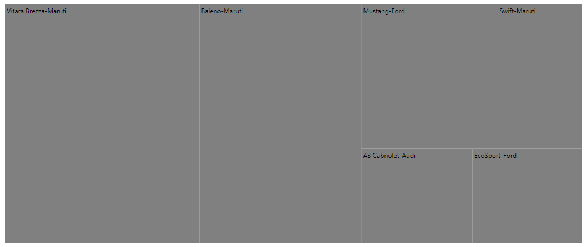

# Labels

Data labels are used to identify the name of items or groups in the TreeMap component. Data labels will be shown by given specified [`LabelPath`](https://help.syncfusion.com/cr/aspnetcore-blazor/Syncfusion.Blazor~Syncfusion.Blazor.TreeMap.LeafItemSettingsModel~LabelPath.html) in the data source field.

The following options are available to customize the labels in the TreeMap component.

## Formatting labels

You can customize the labels for each item using the [`LabelFormat`](https://help.syncfusion.com/cr/aspnetcore-blazor/Syncfusion.Blazor~Syncfusion.Blazor.TreeMap.LeafItemSettingsModel~LabelPath.html) property in [`TreeMapLeafItemSettings`](https://help.syncfusion.com/cr/aspnetcore-blazor/Syncfusion.Blazor~Syncfusion.Blazor.TreeMap.LeafItemSettingsModel_members.html).

The label format is shown in the following code example.

```csharp
@using Syncfusion.Blazor.TreeMap

<SfTreeMap WeightValuePath="Count" TValue="Car" DataSource="Cars" RangeColorValuePath="Count">
    <TreeMapLeafItemSettings LabelPath="Name" LabelFormat="${Name}-${Brand}"></TreeMapLeafItemSettings>
</SfTreeMap>

@code {
    public class Car
    {
        public string Name;
        public string Brand;
        public int Count;
    };

    private List<Car> Cars = new List<Car> {
        new Car { Name="Mustang", Brand="Ford", Count=232 },
        new Car { Name="EcoSport", Brand="Ford", Count=121 },
        new Car { Name="Swift", Brand="Maruti", Count=143 },
        new Car { Name="Baleno", Brand="Maruti", Count=454 },
        new Car { Name="Vitara Brezza", Brand="Maruti", Count=545 },
        new Car { Name="A3 Cabriolet", Brand="Audi",Count=123 },
        new Car { Name="RS7 Sportback", Brand="Audi", Count=523 }
    };
}
```



## Label position

Using the [`LabelPosition`](https://help.syncfusion.com/cr/cref_files/aspnetcore-blazor/Syncfusion.Blazor~Syncfusion.Blazor.TreeMap.TreeMapLeafItemSettings~_labelPosition.html) property, you can position the labels at any of the following locations.

* BottomCenter
* BottomLeft
* BottomRight
* Center
* CenterLeft
* CenterRight
* TopCenter
* TopLeft
* TopRight

```csharp
@using Syncfusion.Blazor.TreeMap

<SfTreeMap WeightValuePath="Count" TValue="Car" DataSource="Cars" RangeColorValuePath="Count">
    <TreeMapLeafItemSettings LabelPath="Name"
                             LabelFormat="${Name}-${Brand}"
                             LabelPosition="LabelPosition.Center"
                             Gap="2"></TreeMapLeafItemSettings>
</SfTreeMap>
```

> Refer [code block](#formatting-labels) to know the property value of `Cars`.


## Intersect action

You can avoid overlapping by customizing the labels in each item when they exceed their actual size using the [`InterSectAction`](https://help.syncfusion.com/cr/aspnetcore-blazor/Syncfusion.Blazor~Syncfusion.Blazor.TreeMap.LeafItemSettingsModel~InterSectAction.html) property in [`TreeMapLeafItemSettings`](https://help.syncfusion.com/cr/aspnetcore-blazor/Syncfusion.Blazor~Syncfusion.Blazor.TreeMap.LeafItemSettingsModel_members.html).

The intersect action concepts are illustrated in the following code example.

```csharp
@using Syncfusion.Blazor.TreeMap

<SfTreeMap WeightValuePath="Count"
            TValue="Car"
            DataSource="Cars">
    <TreeMapLeafItemSettings LabelPath="Name"
                             LabelFormat="${Name}-${Brand}"
                             InterSectAction="LabelAlignment.WrapByWord">
    </TreeMapLeafItemSettings>
</SfTreeMap>

@code{
    public class Car
    {
        public string Name;
        public string Brand;
        public int Count;
    };

    private List<Car> Cars = new List<Car> {
        new Car { Name="Mustang", Brand="Ford Motor Company", Count=232 },
        new Car { Name="Lincoln Continental Mark V", Brand="Ford Motor Company", Count=50},
        new Car { Name="EcoSport", Brand="Ford Motor Company", Count=121 },
        new Car { Name="Swift", Brand="Maruti", Count=143 },
        new Car { Name="Baleno", Brand="Maruti", Count=454 },
        new Car { Name="Vitara Brezza", Brand="Maruti", Count=545 },
        new Car { Name="A3 Cabriolet", Brand="Audi",Count=123 },
        new Car { Name="RS7 Sportback", Brand="Audi", Count=523 }
    };
}
```

