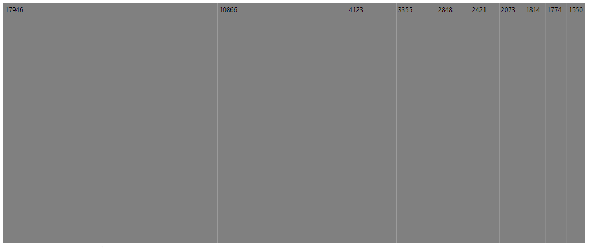
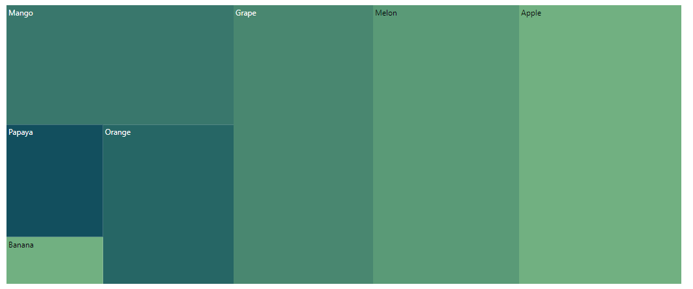

# Layout

You can determine the visual representation of nodes belonging to all the TreeMap levels using the [`LayoutType`](https://help.syncfusion.com/cr/aspnetcore-blazor/Syncfusion.Blazor~Syncfusion.Blazor.TreeMap.SfTreeMap~LayoutType.html) property.

## Types of layout

The available layout types are,

* Squarified
* SliceAndDiceVertical
* SliceAndDiceHorizontal
* SliceAndDiceAuto

### Squarified

The Squarified layout displays the nested rectangles based on aspect ratio in TreeMap. The rectangles will be split based on the height and width of parent. The default rendering type of layout is [`Squarified`](https://help.syncfusion.com/cr/aspnetcore-blazor/Syncfusion.Blazor~Syncfusion.Blazor.TreeMap.LayoutMode.html).

```csharp
@using Syncfusion.Blazor.TreeMap

<SfTreeMap DataSource="GrowthReports" TValue="GDPReport" WeightValuePath="GDP">
</SfTreeMap>

@code {
    public class GDPReport
    {
        public string CountryName;
        public double GDP;
        public double Percentage;
        public int Rank;
    };

    private List<GDPReport> GrowthReports = new List<GDPReport> {
            new GDPReport {CountryName="United States", GDP=17946, Percentage=11.08, Rank=1},
            new GDPReport {CountryName="China", GDP=10866, Percentage= 28.42, Rank=2},
            new GDPReport {CountryName="Japan", GDP=4123, Percentage=-30.78, Rank=3},
            new GDPReport {CountryName="Germany", GDP=3355, Percentage=-5.19, Rank=4},
            new GDPReport {CountryName="United Kingdom", GDP=2848, Percentage=8.28, Rank=5},
            new GDPReport {CountryName="France", GDP=2421, Percentage=-9.69, Rank=6},
            new GDPReport {CountryName="India", GDP=2073, Percentage=13.65, Rank=7},
            new GDPReport {CountryName="Italy", GDP=1814, Percentage=-12.45, Rank=8},
            new GDPReport {CountryName="Brazil", GDP=1774, Percentage=-27.88, Rank=9},
            new GDPReport {CountryName="Canada", GDP=1550, Percentage=-15.02, Rank=10}
    };
}
```


### Slice and dice vertical

The [`SliceAndDiceVertical`](https://help.syncfusion.com/cr/aspnetcore-blazor/Syncfusion.Blazor~Syncfusion.Blazor.TreeMap.LayoutMode.html) layout creates rectangles with high aspect ratio and displays them sorted vertically.

```csharp
@using Syncfusion.Blazor.TreeMap

<SfTreeMap DataSource="GrowthReports"
            TValue="GDPReport"
            WeightValuePath="GDP"
            LayoutType="LayoutMode.SliceAndDiceVertical">
</SfTreeMap>
```

> Refer [code block](#squarified) to know the property value of `GrowthReports`.


### Slice and dice horizontal

The [`SliceAndDiceHorizontal`](https://help.syncfusion.com/cr/aspnetcore-blazor/Syncfusion.Blazor~Syncfusion.Blazor.TreeMap.LayoutMode.html) layout creates rectangles with high aspect ratio and displays them sorted horizontally.

```csharp
@using Syncfusion.Blazor.TreeMap

<SfTreeMap DataSource="GrowthReports"
            TValue="GDPReport"
            WeightValuePath="GDP"
            LayoutType="LayoutMode.SliceAndDiceHorizontal">
</SfTreeMap>
```

> Refer [code block](#squarified) to know the property value of `GrowthReports`.


### Slice and dice auto

The [`SliceAndDiceAuto`](https://help.syncfusion.com/cr/aspnetcore-blazor/Syncfusion.Blazor~Syncfusion.Blazor.TreeMap.LayoutMode.html) layout creates rectangles with high aspect ratio and displays them sorted both horizontally and vertically.

```csharp
@using Syncfusion.Blazor.TreeMap

<SfTreeMap DataSource="GrowthReports"
            TValue="GDPReport"
            WeightValuePath="GDP"
            LayoutType="LayoutMode.SliceAndDiceAuto">
</SfTreeMap>
```

> Refer [code block](#squarified) to know the property value of `GrowthReports`.



## Rendering direction

By default, the direction of TreeMap item is [`TopLeftBottomRight`](https://help.syncfusion.com/cr/aspnetcore-blazor/Syncfusion.Blazor~Syncfusion.Blazor.TreeMap.RenderingMode.html). You can customize the rendering direction of the TreeMap item by setting the [`RenderDirection`](https://help.syncfusion.com/cr/cref_files/aspnetcore-blazor/Syncfusion.Blazor~Syncfusion.Blazor.TreeMap.SfTreeMap%601~RenderDirection.html) property.

The TreeMap can be rendered in the following four different directions:
      [`TopLeftBottomRight`](https://help.syncfusion.com/cr/aspnetcore-blazor/Syncfusion.Blazor~Syncfusion.Blazor.TreeMap.RenderingMode.html),
      [`TopRightBottomLeft`](https://help.syncfusion.com/cr/aspnetcore-blazor/Syncfusion.Blazor~Syncfusion.Blazor.TreeMap.RenderingMode.html),
      [`BottomRightTopLeft`](https://help.syncfusion.com/cr/aspnetcore-blazor/Syncfusion.Blazor~Syncfusion.Blazor.TreeMap.RenderingMode.html), and
      [`BottomLeftTopRight`](https://help.syncfusion.com/cr/aspnetcore-blazor/Syncfusion.Blazor~Syncfusion.Blazor.TreeMap.RenderingMode.html)

The following example demonstrate how to render the TreeMap in the RTL direction with [`TopLeftBottomRight`](https://help.syncfusion.com/cr/aspnetcore-blazor/Syncfusion.Blazor~Syncfusion.Blazor.TreeMap.RenderingMode.html).

```csharp
@using Syncfusion.Blazor.TreeMap

<SfTreeMap DataSource="Fruits"
            TValue="Fruit"
            WeightValuePath="Count"
            Palette='new string[]{"#71B081","#5A9A77", "#498770", "#39776C", "#266665","#124F5E"}'
            RenderDirection="RenderingMode.TopLeftBottomRight">
    <TreeMapLeafItemSettings LabelPath="Name">
    </TreeMapLeafItemSettings>
    <TreeMapTooltipSettings Visible=true Format="${Count} : ${Name}">
    </TreeMapTooltipSettings>
</SfTreeMap>

@code{
    public class Fruit
    {
        public string Name;
        public int Count;
    };
    private List<Fruit> Fruits = new List<Fruit> {
        new Fruit { Name="Apple", Count=5000 },
        new Fruit { Name="Mango", Count=3000 },
        new Fruit { Name="Orange", Count=2300 },
        new Fruit { Name="Banana", Count=500 },
        new Fruit { Name="Grape", Count=4300 },
        new Fruit { Name="Papaya", Count=1200 },
        new Fruit { Name="Melon", Count=4500 }
    };
}
```


The following example demonstrate how to render the TreeMap in the RTL direction with [`TopRightBottomLeft`](https://help.syncfusion.com/cr/aspnetcore-blazor/Syncfusion.Blazor~Syncfusion.Blazor.TreeMap.RenderingMode.html).

```csharp
@using Syncfusion.Blazor.TreeMap

<SfTreeMap DataSource="Fruits"
            TValue="Fruit"
            WeightValuePath="Count"
            Palette='new string[]{"#71B081","#5A9A77", "#498770", "#39776C", "#266665","#124F5E"}'
            RenderDirection="RenderingMode.TopRightBottomLeft">
    <TreeMapLeafItemSettings LabelPath="Name">
    </TreeMapLeafItemSettings>
    <TreeMapTooltipSettings Visible=true Format="${Count} : ${Name}">
    </TreeMapTooltipSettings>
</SfTreeMap>
```

> Refer [code block](#rendering-direction) to know the property value of `Fruits`.



The following example demonstrate how to render the TreeMap in the RTL direction with [`BottomRightTopLeft`](https://help.syncfusion.com/cr/aspnetcore-blazor/Syncfusion.Blazor~Syncfusion.Blazor.TreeMap.RenderingMode.html).

```csharp
@using Syncfusion.Blazor.TreeMap

<SfTreeMap DataSource="Fruits"
            TValue="Fruit"
            WeightValuePath="Count"
            Palette='new string[]{"#71B081","#5A9A77", "#498770", "#39776C", "#266665","#124F5E"}'
            RenderDirection="RenderingMode.BottomRightTopLeft">
    <TreeMapLeafItemSettings LabelPath="Name">
    </TreeMapLeafItemSettings>
    <TreeMapTooltipSettings Visible=true Format="${Count} : ${Name}">
    </TreeMapTooltipSettings>
</SfTreeMap>
```

> Refer [code block](#rendering-direction) to know the property value of `Fruits`.


The following example demonstrate how to render the TreeMap in the RTL direction with [`BottomLeftTopRight`](https://help.syncfusion.com/cr/aspnetcore-blazor/Syncfusion.Blazor~Syncfusion.Blazor.TreeMap.RenderingMode.html).

```csharp
@using Syncfusion.Blazor.TreeMap

<SfTreeMap DataSource="Fruits"
            TValue="Fruit"
            WeightValuePath="Count"
            Palette='new string[]{"#71B081","#5A9A77", "#498770", "#39776C", "#266665","#124F5E"}'
            RenderDirection="RenderingMode.BottomLeftTopRight">
    <TreeMapLeafItemSettings LabelPath="Name">
    </TreeMapLeafItemSettings>
    <TreeMapTooltipSettings Visible=true Format="${Count} : ${Name}">
    </TreeMapTooltipSettings>
</SfTreeMap>
```

> Refer [code block](#rendering-direction) to know the property value of `Fruits`.


