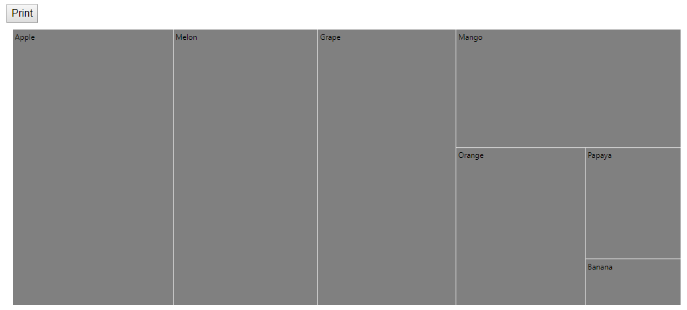
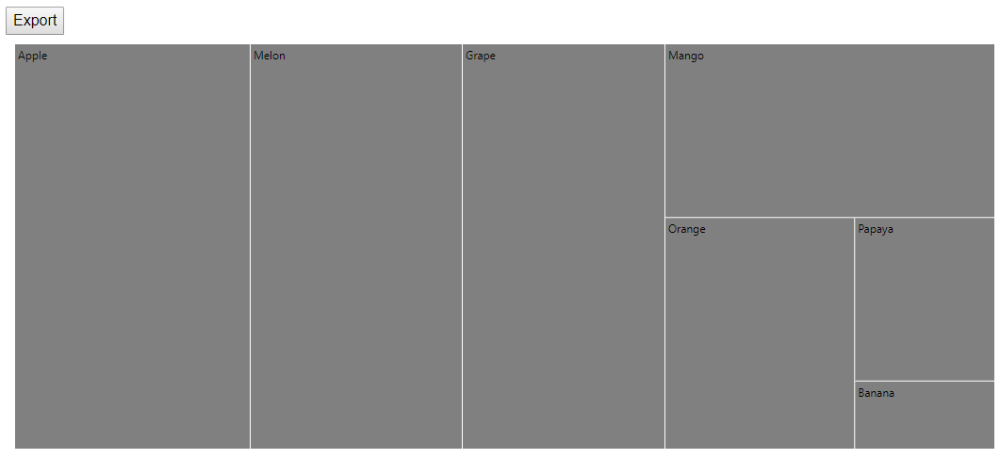

# Print and Export

## Print

The rendered TreeMap can be printed directly from the browser by calling the public method [`Print`](https://help.syncfusion.com/cr/aspnetcore-blazor/Syncfusion.Blazor~Syncfusion.Blazor.Maps.EjsMaps~Print.html). You can get the TreeMap component object using `@ref="treemap"`.

```csharp
@using Syncfusion.Blazor.TreeMap

<button @onclick="PrintTreeMap">Print</button>
<SfTreeMap @ref="treemap" WeightValuePath="Count" TValue="Fruit" DataSource="Fruits">
    <TreeMapLeafItemSettings LabelPath="Name" Gap="2"></TreeMapLeafItemSettings>
</SfTreeMap>

@code {
    SfTreeMap<Fruit> treemap;
    void PrintTreeMap()
    {
        treemap.Print();
    }
    public class Fruit
    {
        public string Name;
        public int Count;
    };

    private List<Fruit> Fruits = new List<Fruit> {
        new Fruit { Name="Apple", Count=5000 },
        new Fruit { Name="Mango", Count=3000 },
        new Fruit { Name="Orange", Count=2300 },
        new Fruit { Name="Banana", Count=500 },
        new Fruit { Name="Grape", Count=4300 },
        new Fruit { Name="Papaya", Count=1200 },
        new Fruit { Name="Melon", Count=4500 }
    };

}
```



## Export

The rendered TreeMap can be exported to following formats by using export method. Input parameters for this method are export type for format and file name of result.

<b>Supported formats</b>
1. PNG
2. JPEG
3. SVG
4. PDF

```csharp
@using Syncfusion.Blazor.TreeMap

<button @onclick="ExportTreeMap">Export</button>
<SfTreeMap @ref="treemap" WeightValuePath="Count" TValue="Fruit" DataSource="Fruits">
    <TreeMapLeafItemSettings LabelPath="Name" Gap="2"></TreeMapLeafItemSettings>
</SfTreeMap>

@code {
    SfTreeMap<Fruit> treemap;
    void ExportTreeMap()
    {
        treemap.Export(ExportType.PDF, "Fruits details");
    }
}
```

> Refer [code block](#print) to know the property value of `Fruits`.

