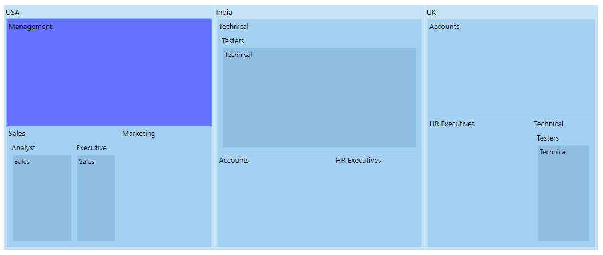

# Selection and Highlight

## Selection

Selection is used to select a particular group or item to differentiate from other items. Each item or each group can be selected and deselected when interacting with the items.

By tapping a specific legend, the TreeMap items bound to the selected legend are also selected and vice-versa.

The layer [`Fill`](https://help.syncfusion.com/cr/aspnetcore-blazor/Syncfusion.Blazor~Syncfusion.Blazor.TreeMap.TreeMapSelectionSettings~Fill.html) property is used to change the selected item color. The [`Color`](https://help.syncfusion.com/cr/aspnetcore-blazor/Syncfusion.Blazor~Syncfusion.Blazor.TreeMap.TreeMapSelectionBorder_members.html) and [`Width`](https://help.syncfusion.com/cr/aspnetcore-blazor/Syncfusion.Blazor~Syncfusion.Blazor.TreeMap.TreeMapSelectionBorder_members.html) properties are used to customize the selected item's border.

The selection is enabled using the [`Enable`](https://help.syncfusion.com/cr/aspnetcore-blazor/Syncfusion.Blazor~Syncfusion.Blazor.TreeMap.TreeMapSelectionSettings~Enable.html) property in the [`TreeMapSelectionSettings`](https://help.syncfusion.com/cr/aspnetcore-blazor/Syncfusion.Blazor~Syncfusion.Blazor.TreeMap.TreeMapSelectionSettings_members.html) tag.

Tree map selection is shown in the following example.

```csharp
@using Syncfusion.Blazor.TreeMap

<SfTreeMap WeightValuePath="EmployeeCount" TValue="Employee"
            DataSource="Employees">
    <TreeMapLeafItemSettings LabelPath="JobDescription" Fill="#8ebfe2"></TreeMapLeafItemSettings>
    <TreeMapLevels>
        <TreeMapLevel GroupPath="Country" Fill="#c5e2f7">
        </TreeMapLevel>
        <TreeMapLevel GroupPath="JobDescription" Fill="#a4d1f2">
        </TreeMapLevel>
        <TreeMapLevel GroupPath="JobGroup" Fill="#a4d1f2">
        </TreeMapLevel>
    </TreeMapLevels>
    <TreeMapSelectionSettings Enable="true" Fill="blue">
        <TreeMapSelectionBorder Color="black" Width="0.5"></TreeMapSelectionBorder>
    </TreeMapSelectionSettings>
</SfTreeMap>

@code{
    public class Employee
    {
        public string Country;
        public string JobDescription;
        public string JobGroup;
        public int EmployeeCount;
    };

    private List<Employee> Employees = new List<Employee> {
        new Employee { Country= "USA", JobDescription= "Sales", JobGroup= "Executive", EmployeeCount= 20 },
        new Employee { Country= "USA", JobDescription= "Sales", JobGroup= "Analyst", EmployeeCount= 30 },
        new Employee { Country= "USA", JobDescription= "Marketing", EmployeeCount= 40 },
        new Employee { Country= "USA", JobDescription= "Management", EmployeeCount= 80 },
        new Employee { Country= "India", JobDescription= "Technical", JobGroup= "Testers", EmployeeCount= 100 },
        new Employee { Country= "India", JobDescription= "HR Executives", EmployeeCount= 30 },
        new Employee { Country= "India", JobDescription= "Accounts", EmployeeCount= 40 },
        new Employee { Country= "UK", JobDescription= "Technical", JobGroup= "Testers", EmployeeCount= 30 },
        new Employee { Country= "UK", JobDescription= "HR Executives", EmployeeCount= 50 },
        new Employee { Country= "UK", JobDescription= "Accounts", EmployeeCount= 60 }
    };
}
```


## Highlight

Highlight is used to highlight an item or group from other items or groups. Each item or each group can be highlighted when hovering the mouse over items.

By hovering over a specific legend, the TreeMap items bound to the selected legend are also highlighted and vice-versa.

The layer [`Fill`](https://help.syncfusion.com/cr/aspnetcore-blazor/Syncfusion.Blazor~Syncfusion.Blazor.TreeMap.TreeMapHighlightSettings~Fill.html) property is used to change the highlighted item color. The [`Color`](https://help.syncfusion.com/cr/aspnetcore-blazor/Syncfusion.Blazor~Syncfusion.Blazor.TreeMap.TreeMapHighlightBorder~_ctor.html) and [`Width`](https://help.syncfusion.com/cr/aspnetcore-blazor/Syncfusion.Blazor~Syncfusion.Blazor.TreeMap.TreeMapHighlightBorder~_ctor.html) properties are used to customize the highlighted shape border. You can highlight an item by hovering the mouse over the item. The highlight is enabled using the [`Enable`](https://help.syncfusion.com/cr/aspnetcore-blazor/Syncfusion.Blazor~Syncfusion.Blazor.TreeMap.TreeMapHighlightSettings~Enable.html) property in the [`TreeMapHighlightSettings`](https://help.syncfusion.com/cr/aspnetcore-blazor/Syncfusion.Blazor~Syncfusion.Blazor.TreeMap.TreeMapHighlightSettings_members.html) tag.

The following code example demonstrates how to highlight an item.

```csharp
@using Syncfusion.Blazor.TreeMap

<SfTreeMap WeightValuePath="EmployeeCount"
            TValue="Employee"
            DataSource="Employees">
    <TreeMapLeafItemSettings LabelPath="JobDescription" Fill="#8ebfe2"></TreeMapLeafItemSettings>
    <TreeMapLevels>
        <TreeMapLevel GroupPath="Country" Fill="#c5e2f7">
        </TreeMapLevel>
        <TreeMapLevel GroupPath="JobDescription" Fill="#a4d1f2">
        </TreeMapLevel>
        <TreeMapLevel GroupPath="JobGroup" Fill="#a4d1f2">
        </TreeMapLevel>
    </TreeMapLevels>
    <TreeMapHighlightSettings Enable=true Fill="blue">
        <TreeMapHighlightBorder Color="black" Width="0.3">
        </TreeMapHighlightBorder>
    </TreeMapHighlightSettings>
</SfTreeMap>
```

> Refer [code block](#selection) to know the property value of `Employees`.

